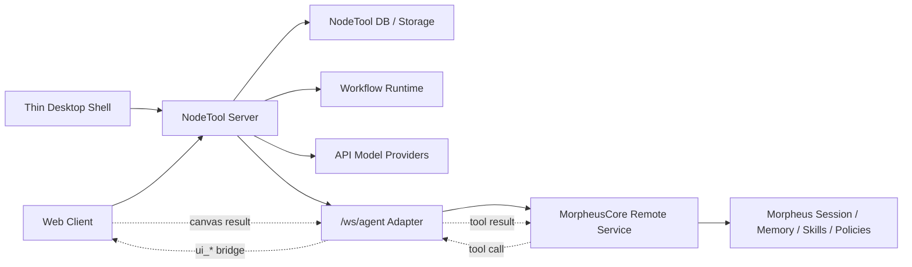

# API-First Morpheus B/S Design

**Date:** 2026-06-14
**Status:** Approved (brainstorm)
**Scope:** Rework NodeTool toward an API-first browser/server product, replace the default Pi-backed canvas assistant with a remote MorpheusCore agent runtime, and keep a thin desktop shell as a later client shape.

## Summary

NodeTool should become a browser/server product whose server remains the
product control plane: users, workflows, canvas state, assets, storage,
model configuration, workflow execution, and realtime websocket fan-out stay
in NodeTool. MorpheusCore becomes the remote agent runtime behind the canvas
assistant. The browser and the future desktop shell connect only to NodeTool;
NodeTool connects to MorpheusCore through a server-side adapter.

The first migration path is adapter-first and incremental. Local model
capabilities are hidden by default but remain available behind an advanced
configuration switch. API providers, including custom OpenAI-compatible and
Anthropic-compatible endpoints, become the default model surface. Pi can
remain as a legacy provider during migration, but the default canvas assistant
becomes Morpheus-backed.

## Goals

- Make NodeTool usable as a complete B/S service with the existing server as
  the primary backend.
- Default the product surface to API providers and hide local model management
  unless explicitly enabled.
- Add first-class custom OpenAI-compatible and Anthropic-compatible endpoints
  for private model gateways and testing.
- Replace Pi as the default canvas assistant with a remote MorpheusCore
  adapter.
- Preserve the existing frontend tool bridge so the agent can operate the
  canvas interactively.
- Store agent session truth in MorpheusCore while NodeTool stores UI thread
  mirrors and thread-to-session mappings.
- Prepare the desktop client to become a thin shell around the same web app.

## Non-Goals

- Do not remove existing local model provider implementations.
- Do not rewrite the workflow runtime.
- Do not let browsers call MorpheusCore directly.
- Do not design a graph patch protocol for the first phase.
- Do not make desktop local connectors part of the B/S MVP.
- Do not embed MorpheusCore inside the NodeTool server process.

## Design Choices

| Fork | Choice | Rationale |
|---|---|---|
| Migration style | Adapter-first incremental migration | Lowest risk; preserves current `/ws/agent` and canvas tool bridge while adding Morpheus. |
| Local models | Hidden by default, advanced re-enable | API-first product surface without destroying local-first capabilities. |
| Custom models | First-class custom compatible endpoints | Needed for private gateways, model-service testing, and future provider experimentation. |
| Morpheus integration | Remote service | Keeps MorpheusCore as its own runtime and avoids process/runtime coupling. |
| Session authority | MorpheusCore owns agent session context | Preserves Morpheus memory, experience, skills, policy, and session semantics. |
| Canvas operation | Tool-call bridge | Reuses the current Pi-style bridge and keeps interactive correction possible. |
| Desktop shape | Thin desktop shell | One client codebase, remote server by default, native connectors later. |

## Target Architecture



NodeTool remains the product and canvas control plane. MorpheusCore is the
agent runtime plane. The browser and thin desktop shell only authenticate to
NodeTool. Morpheus credentials, endpoint URLs, and session coordination stay
server-side.

## API-First Model Surface

NodeTool should introduce a model-surface setting such as:

```text
NODETOOL_MODEL_SURFACE=api_first | local_first
```

`api_first` is the default for B/S deployments. In that mode, the default
visible providers are hosted or API-backed providers:

- OpenAI, Anthropic, Gemini, Groq, Mistral, DeepSeek, xAI, Cohere
- OpenRouter, Together, Cerebras and other hosted LLM APIs
- FAL, KIE, Replicate, Topaz, Reve, AtlasCloud, Meshy, Rodin
- Voyage, Jina and other embedding/reranking APIs
- Custom OpenAI-compatible endpoints
- Custom Anthropic-compatible endpoints

The default hidden providers and features are:

- Ollama, LM Studio, llama.cpp, vLLM
- Transformers.js local cache
- HuggingFace local cache and download management
- Local model download websockets
- Local SAM-style browser or server model downloads
- UI pages whose only purpose is local cache/model management

The filtering must happen both server-side and client-side. Server-side
filtering prevents agent tools and API clients from seeing hidden local
models. Client-side capability flags prevent dead controls and local-first
navigation from appearing in the default product.

### Server Responsibilities

- Add a single helper that classifies providers and model-management
  procedures as API-first or local-only.
- Apply that helper to `modelsRouter.providers`, `modelsRouter.all`,
  `modelsRouter.availableForKind`, and the recommended-model procedures.
- Return empty results or capability errors for local cache/download
  procedures when local models are hidden.
- Keep provider registry support for local providers so advanced mode and
  future desktop connectors can re-enable them.
- Make `ui_search_models` use the same filtered model surface.

### Client Responsibilities

- Read server capabilities rather than scattering `isProduction()` checks.
- Hide local model menus, local cache pages, local downloads, and Local
  SAM-style tools in API-first mode.
- Keep advanced re-enable paths explicit and administrative.

## Custom Compatible Model Endpoints

Custom compatible endpoints are part of the default API-first surface. They
support private model gateways and testing without requiring local model mode.

The canonical V1 configuration shape is:

```ts
interface CustomModelEndpoint {
  id: string;
  name: string;
  protocol: "openai_compatible" | "anthropic_compatible";
  baseUrl: string;
  apiKeySecret?: string;
  defaultHeaders?: Record<string, string>;
  models: Array<{
    id: string;
    label: string;
    capabilities: Array<
      | "text_generation"
      | "tool_calling"
      | "embedding"
      | "vision"
      | "reasoning"
    >;
  }>;
}
```

API keys must be stored through NodeTool secrets and never sent to the client.
The first version supports manually entered model lists only. Automatic model
discovery through `/models` is out of scope for phase 1.

Runtime provider resolution should instantiate the correct compatible adapter
from the custom endpoint's protocol and base URL. The model router should
merge these configured models into provider lists and `availableForKind`
results.

## Morpheus Agent Adapter

The protocol type should add a Morpheus provider:

```ts
type AgentProvider = "llm" | "pi" | "morpheus";
```

The server adds `MorpheusSdkProvider` and `MorpheusQuerySession` behind the
existing `/ws/agent` route. The adapter translates NodeTool agent socket
commands to MorpheusCore remote API calls.

### Command Mapping

```text
create_session
  -> POST /api/v1/sessions or a prompt call that creates a session

send_message
  -> POST /api/v1/prompt/stream

stop_execution
  -> abort the active fetch and call Morpheus cancel/abort when available

list_sessions
  -> Morpheus sessions API

get_session_messages
  -> Morpheus session API, mapped to NodeTool transcript messages
```

### Event Mapping

```text
Morpheus session       -> NodeTool session metadata
Morpheus text_delta    -> NodeTool assistant message delta
Morpheus thinking_*    -> NodeTool thinking/status message
Morpheus toolcall_*    -> NodeTool tool-call status
Morpheus tool_start    -> NodeTool tool execution started
Morpheus tool_end      -> NodeTool tool execution result
Morpheus question      -> NodeTool answer UI / clarification flow
Morpheus done          -> NodeTool completion
Morpheus error         -> NodeTool error message
```

### Session Ownership

MorpheusCore is the source of truth for agent session context. NodeTool stores
only:

- UI-visible thread and message mirrors
- `threadId -> morpheusSessionId`
- `morpheusSessionId -> threadId`
- current stream state needed for cancellation and reconnection

NodeTool should not replay full agent history to MorpheusCore on every turn.
That would weaken MorpheusCore's session, memory, experience, and skill
mechanisms.

### Configuration

```text
MORPHEUS_BASE_URL
MORPHEUS_API_KEY
MORPHEUS_DEFAULT_AGENT_ID
MORPHEUS_DEFAULT_PROFILE
MORPHEUS_TIMEOUT_MS
```

Only the NodeTool server reads these values.

## Canvas Tool Bridge

The first version keeps the existing tool-call bridge instead of designing a
new graph patch protocol.

```text
MorpheusCore Agent
  -> ui_* tool call
NodeTool Morpheus Adapter
  -> tool_call_request over /ws/agent
Web Client active canvas
  -> executes ReactFlow/store operation
NodeTool Morpheus Adapter
  -> tool result
MorpheusCore Agent
```

The tools are the existing frontend tool manifest entries, including:

- `ui_get_graph`
- `ui_search_nodes`
- `ui_add_node`
- `ui_update_node_data`
- `ui_connect_nodes`
- `ui_search_models`
- `ui_graph`
- `ui_save_workflow`

The adapter converts the current frontend manifest into Morpheus-visible
tools when a Morpheus session is created or refreshed. When Morpheus emits a
matching tool call, the adapter forwards it to the active NodeTool web client
and returns the result to Morpheus.

The first version should treat the frontend manifest as the source of truth
for tool names, parameter schemas, and return shape. A graph patch protocol
can be introduced later as an optimization for batch workflow creation.

## MorpheusCore Profile and Skill Deliverables

The MorpheusCore side must include a dedicated NodeTool canvas agent surface.
This should be delivered as a profile, skill, and agent config:

```text
MorpheusCore/config/profiles/nodetool-canvas/BASE.md
MorpheusCore/config/skills/nodetool-canvas/SKILL.md
MorpheusCore/config/agents/nodetool-canvas.yaml
```

The profile defines the agent identity and role: a NodeTool canvas/workflow
builder that operates only through the provided canvas tools. The skill
defines the operational protocol:

- Do not edit workflow files directly.
- Use only tools exposed in the current session.
- Call `ui_search_nodes` before adding any node.
- Use exact node type and property names returned by search/info tools.
- Use `ui_search_models` before setting model properties.
- Pass full model objects into node model properties when NodeTool requires
  provider and model identifiers.
- Verify the final graph through `ui_get_graph`.
- Ask one concise question when blocked.

If MorpheusCore uses ToolcallRouter policy for this agent, the policy should
allow only the canvas tools, `question`, and the frontend forwarding mechanism
needed for the bridge. File writes and shell execution are not part of the
default canvas agent policy.

## B/S Runtime Boundary

For the B/S MVP, NodeTool server is the only product backend visible to
clients:

```text
Browser / Thin Desktop Shell
  -> NodeTool Server
    -> NodeTool DB / Storage / Workflow Runtime
    -> API Model Providers / Custom Compatible Providers
    -> MorpheusCore Remote Agent Runtime
```

Important boundaries:

- Browser clients never call MorpheusCore directly.
- NodeTool owns Morpheus credentials and consumes Morpheus SSE.
- NodeTool translates Morpheus events into `/ws/agent` messages.
- Workflows, assets, uploads, and temporary files live in NodeTool server
  storage or object storage.
- Local filesystem and local model access are not default B/S capabilities.
- Desktop native connectors are future optional capabilities, not MVP
  prerequisites.

## Thin Desktop Shell

The desktop client should become a thin shell that loads the same web client
and points at a configured NodeTool server. The initial shell should provide:

- server URL configuration
- authentication handoff
- secure local credential storage when needed
- native file picker or directory grant only when a later connector needs it

The shell should not assume a full local NodeTool backend by default. A
local-first desktop mode can remain a separate advanced configuration if the
project chooses to preserve it.

## Implementation Phases

### Phase 1: API-First Model Surface

- Add `NODETOOL_MODEL_SURFACE=api_first | local_first`.
- Add server-side provider/model filtering.
- Hide local cache/download/model-management UI in API-first mode.
- Add custom OpenAI-compatible and Anthropic-compatible endpoint storage.
- Merge custom endpoint models into model discovery and `ui_search_models`.

Acceptance:

- In API-first mode, local models do not appear in UI, tRPC model lists, or
  agent model search results.
- Custom compatible endpoint models appear as selectable API models.
- Local-first mode can still expose the previous local model surface.

### Phase 2: Agent Provider Generalization

- Rename or wrap Pi-specific frontend state into generic agent/Morpheus state.
- Add `"morpheus"` to the shared agent provider protocol.
- Keep Pi as a legacy provider while making Morpheus the target default.
- Update composer controls to show Morpheus-centric labels and configuration.

Acceptance:

- The UI can select the Morpheus provider without Pi workspace assumptions.
- Existing Pi behavior remains available when explicitly selected.

### Phase 3: Morpheus Remote Adapter

- Implement `MorpheusSdkProvider`.
- Implement `MorpheusQuerySession`.
- Stream Morpheus SSE into NodeTool agent messages.
- Implement stop/cancel behavior.
- Persist `threadId <-> morpheusSessionId` mappings.

Acceptance:

- A browser can chat through NodeTool to a remote MorpheusCore service.
- NodeTool does not expose Morpheus credentials to the browser.
- Session resume uses the Morpheus session id instead of replaying history.

### Phase 4: Canvas Tool Bridge and Morpheus Profile

- Convert NodeTool frontend tool manifests into Morpheus-visible tool schemas.
- Forward Morpheus tool calls through the existing `/ws/agent` tool bridge.
- Return frontend tool results back to Morpheus.
- Add `nodetool-canvas` profile, skill, and agent config in MorpheusCore.
- Add a minimal Morpheus policy for canvas-only operation.

Acceptance:

- Morpheus can search nodes, add nodes, connect nodes, set model properties,
  and verify the graph through the browser canvas.
- The Morpheus canvas agent does not need file write access to edit workflows.

### Phase 5: B/S Productization and Thin Desktop Shell

- Document the API-first production deployment path.
- Ensure public/private server modes default to API-first behavior.
- Support static frontend hosting or split frontend/backend deployment.
- Move desktop toward a remote-server shell.
- Keep local desktop connectors as explicit follow-up work.

Acceptance:

- A deployed NodeTool server plus web client provides the primary product
  experience.
- The same web client can be loaded from the desktop shell against a remote
  server.

## Testing Strategy

- Unit-test provider/model filtering for API-first and local-first modes.
- Unit-test custom compatible endpoint validation and model normalization.
- Unit-test Morpheus SSE event mapping into NodeTool agent messages.
- Unit-test session mapping and stop/cancel behavior.
- Integration-test `/ws/agent` with a mocked MorpheusCore SSE stream.
- Integration-test frontend tool-call round trips with a fake Morpheus tool
  call.
- Add UI tests that local model controls are hidden in API-first mode.
- Add regression coverage that `ui_search_models` cannot return hidden local
  models in API-first mode.

## Risks and Mitigations

| Risk | Mitigation |
|---|---|
| Local model code paths remain reachable through agent tools | Apply model-surface filtering server-side and use the same helper for `ui_search_models`. |
| Morpheus and NodeTool transcript state diverge | Treat Morpheus session as source of truth and keep NodeTool transcript as UI mirror only. |
| Tool-call bridge depends on an active browser canvas | Surface clear "no active canvas" errors and require a bound client for canvas sessions. |
| Morpheus profile uses unsafe file/shell tools | Ship a canvas-specific profile, skill, and restrictive tool policy. |
| Custom compatible endpoints leak secrets | Store API keys only in NodeTool secrets and instantiate providers server-side. |
| Desktop expectations conflict with B/S behavior | Position desktop as a thin shell by default and make local connectors explicit. |

## Implementation Defaults

- Store custom compatible endpoint metadata as server-managed settings under
  a `custom_model_endpoints` key for V1. Store API keys in the existing
  NodeTool secret store using deterministic secret names derived from endpoint
  ids, such as `CUSTOM_MODEL_ENDPOINT_<ID>_API_KEY`.
- Do not auto-discover custom endpoint models in phase 1. Users enter the
  model list manually, and each entry declares its capabilities.
- Introduce generic frontend agent naming for new code: `chatAgent`,
  `agentProvider`, `agentModel`, `agentSessionByThread`. Keep Pi-specific
  names only as temporary compatibility wrappers during migration.
- Use `nodetool-canvas` as the Morpheus agent id, profile id, skill id, and
  tool policy id. The MorpheusCore agent config is anchored at
  `config/agents/nodetool-canvas.yaml`; that config references the
  `nodetool-canvas` profile, skill, and policy.
